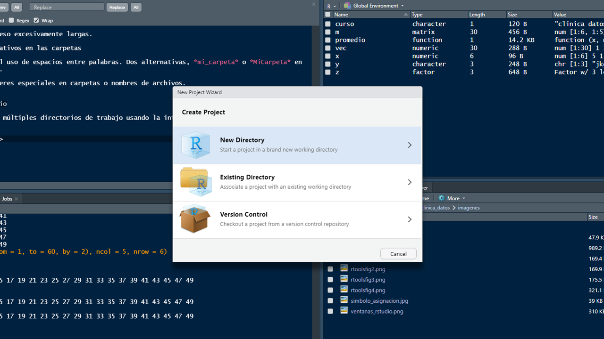
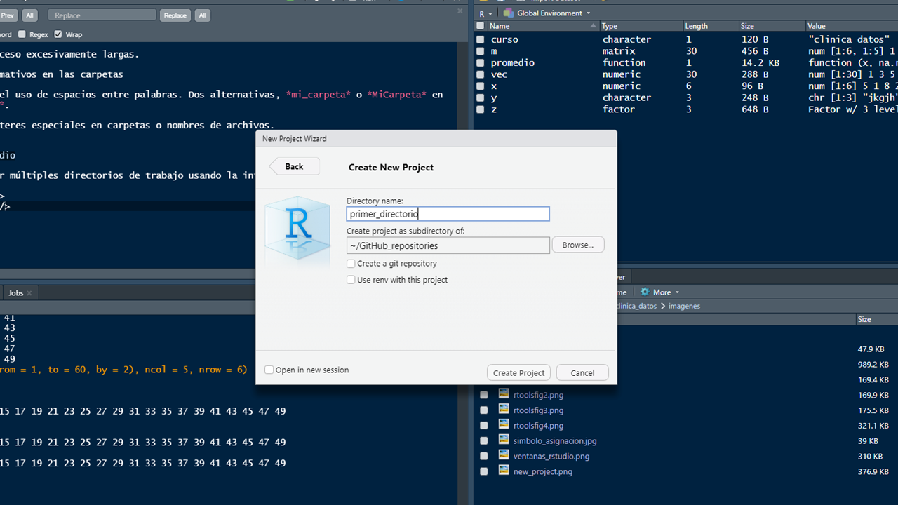

## Directorio de trabajo

Es una ruta de archivo que aloja por defecto todos los archivos en una sesión de R

```{r echo = TRUE}

getwd() # ejecuta la ruta 

dir() # lista de los archivos alojados en el directorio

```

## 

Pueden modificarlo usando la función `setwd()` y especificando la nueva ruta en una cadena de caracter.

```{r echo = TRUE, eval= FALSE}
setwd("C:/Users/andre/Documents/Publications")
```

**Buenas prácticas:**

- Evitar rutas de acceso excesivamente largas.

- Usar nombres informativos en las carpetas 

- Reducir al máximo el uso de espacios entre palabras. Dos alternativas, *mi_carpeta* o *MiCarpeta* en lugar de *mi carpeta*.

- **NO!** usar caracteres especiales en carpetas o nombres de archivos. 


## Proyectos en RStudio

Opción para gestionar múltiples directorios de trabajo usando la interfaz gráfica de RStudio.

<div align = "center">

</div>

##

<div align = "center">

</div>

## Ingresar datos a partir de archivos

Pueden importan información desde archivos `.xlsx`, `.csv` y `.txt`. Pero si lo que requieren es cargár información de paquetes estadísticos como SPSS, Stata, SAS, Systat, entre otros, querrán explorar el paquete `foreing`. Acá trataremos los tres primeros.

**Archivos de Excel .xlsx**

```{r echo = TRUE}
library(readxl) # cargar el paquete readxl y usar la función read_excel
read_excel("ejemplo1.xlsx", sheet = 1, col_names = TRUE)


```

##

En el ejemplo anterior solo indicamos el nombre del archivo dado que está alojado en el directorio. Si no lo estuviera...

```{r echo = TRUE}
read_excel("C:/Users/andre/OneDrive/Escritorio/ejemplo1.xlsx", 
           sheet = 1, col_names = TRUE)

```

Usamos la ruta completa en la que se encuentra el archivo.

## Archivos .csv

Para pasar un .xlsx a .csv en Excel: *save as* **>>** *save as type* **>>** *CSV (Comma delimited)*.
Se usa la función de R base `read.csv()``
```{r echo = TRUE}
read.csv("ejemplo1.csv", sep = ";", dec = ",", header = TRUE)

```
Debe considerar la separación de las columnas —esto depende de la configuración de Excel—, el símbolo que denota los decimales y los encabezados de las columnas.


## Archivos .txt

Para pasar un .xlsx a .txt en Excel: *save as* **>>** *save as type* **>>** *Text (Tab delimited)*.
Se usa la función de R base `read.table()`.

```{r echo = TRUE}
read.table("ejemplo1.txt", header = TRUE, sep = "\t", dec = ",")
```

Recuerde que para guardar la información en el espacio de trabajo (*Global Environment*) debe asignarla a un nombre (i.e., `nombre <- read.table("ejemplo1.txt"...)`). 

## ahora que tiene los datos en R...

**- Explorarlos:**

Tipo de variables 

NAs, NaN, NULL


**- Organizarlos**

Formato largo

Formato ancho

##
Usaremos un set de datos de tres especies de pingüinos del Artico. 

<div align = "center">

</div>

## 

Instale
```{r cho = TRUE, eval=FALSE}
install.packages("palmerpenguins")
```

cargue el paquete y...

```{r echo = TRUE, warning=FALSE}
library(palmerpenguins)

str(penguins)
```


## Clases de variables

Variables de tipo factor o categóricas.

```{r echo = TRUE}

class(penguins$species)

levels(penguins$species)

summary(penguins$species)

```

## 

Numéricas, hay dos tipos.

```{r echo = TRUE}
# integer: números enteros
class(penguins$body_mass_g); summary(penguins$body_mass_g)
# numeric: números reales
class(penguins$bill_length_mm); summary(penguins$bill_length_mm)

```

##

Caracter

```{r echo = TRUE}

class(penguins_raw$Region)

summary(penguins_raw$Region)

```

A diferencia de los factores las cadenas de caracter no tienen niveles o agrupamientos. Mas bien, consisten en secuencias heterogeneas de símbolos cuya manipulación comprende un tema completo en programación computacional, y no serán tratada en este curso.

## NA's

Los `NA` (not available) son un tipo especial de valor que en R denota los datos faltantes, datos cuyo valor es desconocido. Tienden a ser problemáticos en el momento de computar cálculos, así que R ofrece varías formas de lidiar con ellos.

```{r echo = TRUE}

table(is.na(penguins)) # identificar el número de NAs

table(is.na(na.omit(penguins))) # remover NAs

```

## 
La anterior es una práctica que se debe realizar con precaución. Dependiendo del análisis, es preferible evaluar el caso de variables particulares y usar, por ejemplo:

```{r echo = TRUE, eval=FALSE}

subset(penguins, !is.na(penguins$bill_length_mm))

```

O, en funciones como `mean()` el argumento `na.rm=` controla que el cálculo se realice excluyendo, o no, los datos faltantes

```{r echo = TRUE}
mean(penguins$bill_length_mm)
mean(penguins$bill_length_mm, na.rm = T)
```

## Otros valores especiales

**`NaN`** (not a number). Es retornado cuando el computo produce un valor que no es numérico.

**`NULL`**. Es retornado cuando un computo produce un valor indeterminado o inexistente.

**`Inf` - `-Inf`**. Valores muy grandes o el cociente de una división por cero

`NA`, `NaN`, `NULL` e `Inf` son palabras reservadas en R. Es decir, ningún objeto puede adquirir su nombre.

```{r echo = TRUE, error=TRUE}
NA <- "a"

```

## Organizando los datos

Función `rbind()`

```{r echo = TRUE}
(new_peng <- rbind(penguins[penguins$species  == "Adelie", ][1:5, c(1, 3)], 
                  penguins[penguins$species  == "Chinstrap", ][1:5, c(1, 3)], 
                  penguins[penguins$species  == "Gentoo", ][1:5, c(1, 3)]))
```

##

Función `cbind()`

```{r echo = TRUE}
cbind(penguins[1:7, 1:2], penguins[1:7, 3:5])

```

##

Función `merge()`

```{r, echo=TRUE}

v <- sample(1:nrow(penguins), size = 10)
penguins$id <- as.factor(1:nrow(penguins))

merge(penguins[v, c(1:3, length(penguins))], 
      penguins[v, c(1, 2, 4, length(penguins))], 
      by = c("species", "island", "id"))

```

## 

**Formato ancho**

Organización de los datos en la que los niveles de las variables categóricas están diferenciados en las filas. Veamos:

```{r echo = T}

(peng_unst <- unstack(new_peng, bill_length_mm ~ species))

```


## 

**Formato largo**

Los niveles de las variables categóricas están distribuidos a lo largo de las columnas.

```{r echo = F}


stack(peng_unst, select = c(Adelie, Chinstrap, Gentoo))

```

