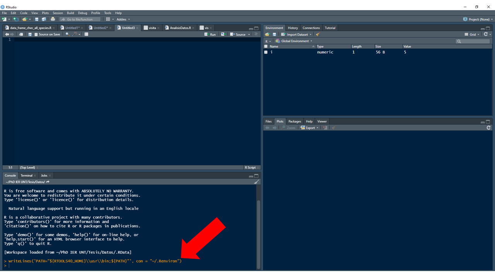
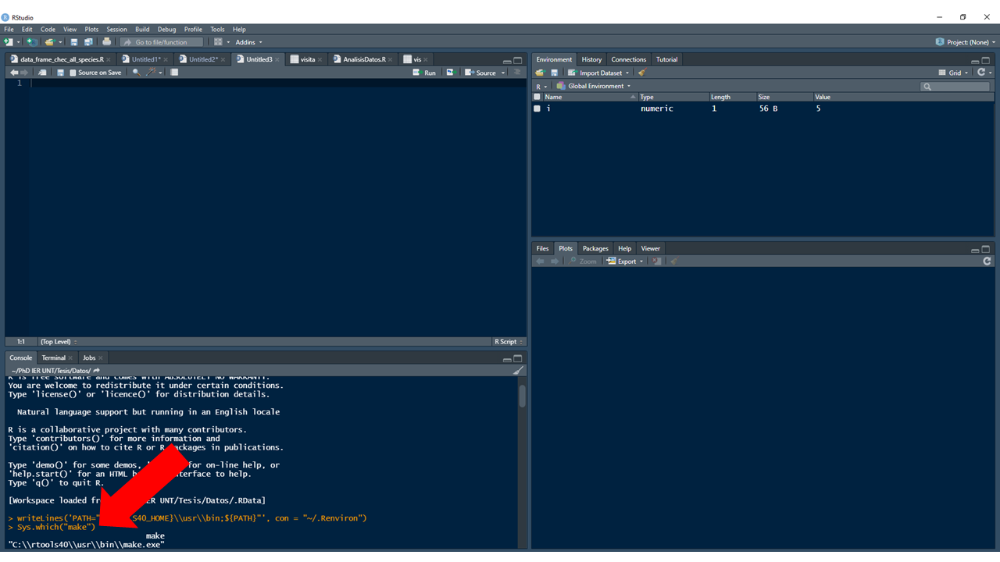
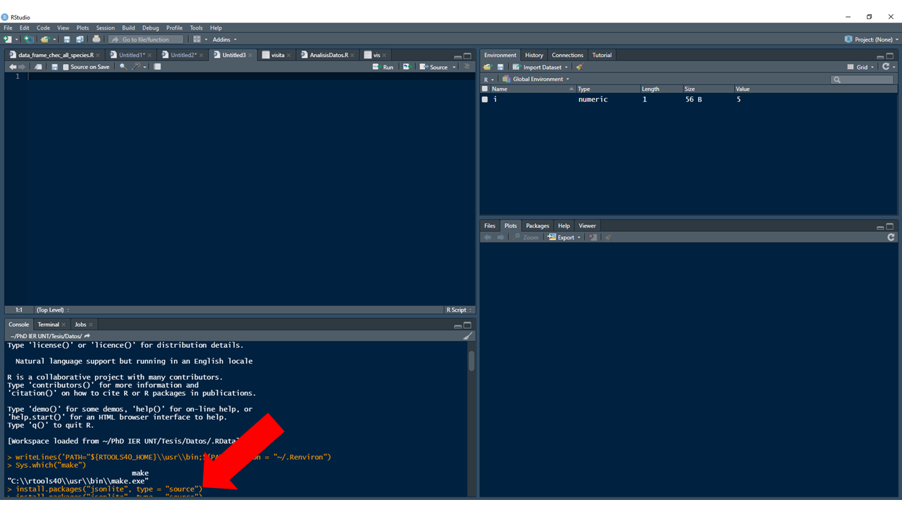
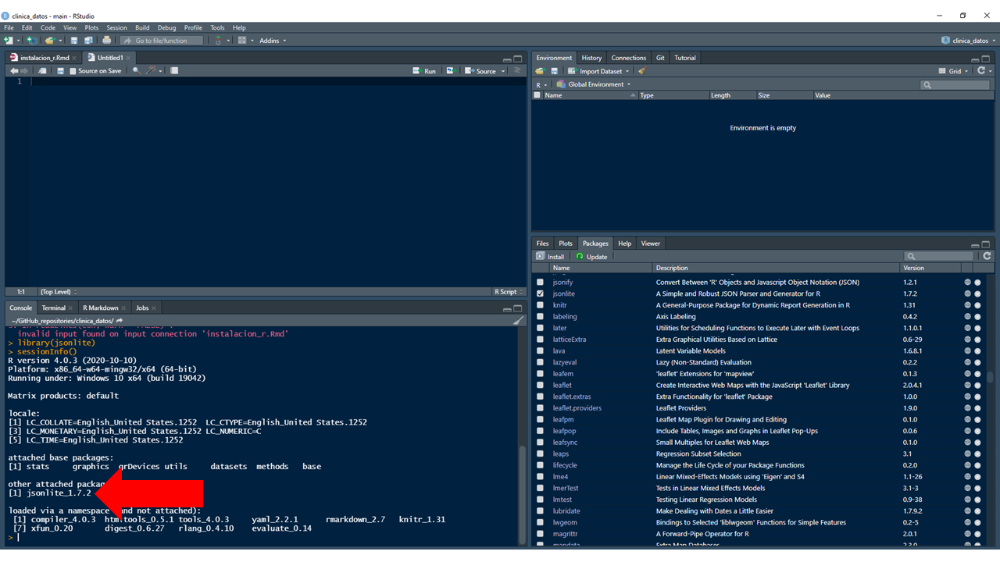

## Un poco de contexto

R es un lenguaje computacional que permite automatizar cálculos complejos a través de algoritmos, y usar herramientas programadas por otros. Es un software altamente flexible, en constante expansión, y aunque fue desarrollado principalmente para el análisis de datos su uso se ha extendido a los SIG, desarrollo de sitios web y aplicaciones.

R se deriva de S, un lenguaje desarrollado por John Chambers et al. en 1976 en Laboratorios Bell. Durante la década de los 90, Ross Ihaka y Robert Gentleman de la Universidad de Auckland experimentaron con S, surgiendo como resultado R. Justamente R recibe su nombre probablemente por las iniciales de sus desarrolladores o simplemente por ser una letra contigua a la S. Cierto o especulación, no deja de ser una historia interesante para contar —en esos términos lo plantean Zurr et al. 2009—

### ¿Por qué usar R?

R es un software de acceso libre y código abierto, con una comunidad de usuarios activa y bastante altruista. Aunque la curva de aprendizaje puede ser lenta, una vez dominados los principios básicos de su sintaxis el uso de líneas de comando para la ejecución de tareas aumenta la reproducibilidad, rapidez y adaptación para el análisis de nueva información.

## Descargando e instalando R y RStudio

Ingresando al [CRAN mirror de la Universidad Nacional de la Plata](http://mirror.fcaglp.unlp.edu.ar/CRAN/) descargue la versión **4.0.3 de R**. El CRAN (Comprehensive R Archive Network) es un repositorio que aloja las distintas versiones de R y los paquetes que lo integran; a cada copia del CRAN alojadas en diferentes instituciones del planeta se le denomina *CRAN mirror*. Si su usted es un usuario de Windows siga la ruta **Download R for Windows** >> **base** >> **Previous releases**, o Mac **Download R for macOS** >> **base**. Descargue el archivo **R-4.0.3-win.exe** para Windows o **R-4.0.3.pkg** para Mac y ejecútelo como administrador. Siga los pasos y sugerencias que le indica el asistente de instalación. 

En este curso usaremos R a través de RStudio IDE (Integrated Developed Environment). Ingrese al sitio de descarga de [RStudio](https://www.rstudio.com/products/rstudio/download/) y seleccione la versión que se ajuste al sistema operativo de su computadora. 

* Windows **RStudio-1.4.1106.exe**
* Mac **RStudio-1.4.1106.dmg**

*Si su sistema operativo es inferior a Windows 10 o macOS 10.13, descargue la versión adecuada* [*aquí*](https://www.rstudio.com/products/rstudio/older-versions/)

_____________________________________________________________________________

Nota: si el sistema operativo de su computadora es Windows debe instalar el complemento Rtools, este garantiza el correcto funcionamiento de los paquetes desarrollados en versiones de R superiores a la 4.0.0. en el CRAN mirror de la UNLP siga la ruta **Download R for Windows** >> **Rtools** y descargue el instalador **rtools40v2-x86_64.exe**. 

Una vez instalado debe ejecutar el siguiente código en la consola de R:

1. Abra RStudio, copie el siguiente código en la consola de R y oprima enter

```{r echo = T, eval=FALSE}

writeLines('PATH="${RTOOLS40_HOME}\\usr\\bin;${PATH}"', con = "~/.Renviron")

```



2. Copie el siguiente código en la consola y presione enter nuevamente. 

```{r echo = T, eval=F}

Sys.which("make")

```



Note que la consola debe retornar `C:\\rtools40\\usr\\bin\\make.exe`

3. Para probar que Rtools funciona correctamente, intente instalando un paquete desde la fuente.

```{r echo = T, eval=F}

install.packages("jsonlite", type = "source")

```



Si el paquete fue instalado correctamente, entonces su R y RStudio estan listos. Puede comprobarlo ejecutando las siguientes líneas de comando. 

```{r echo = T, eval=F}

library(jsonlite)
sessionInfo()

```


El paquete recientemente instalado debe estar cargado como se muestra en la imagen

_____________________________________________________________________________

