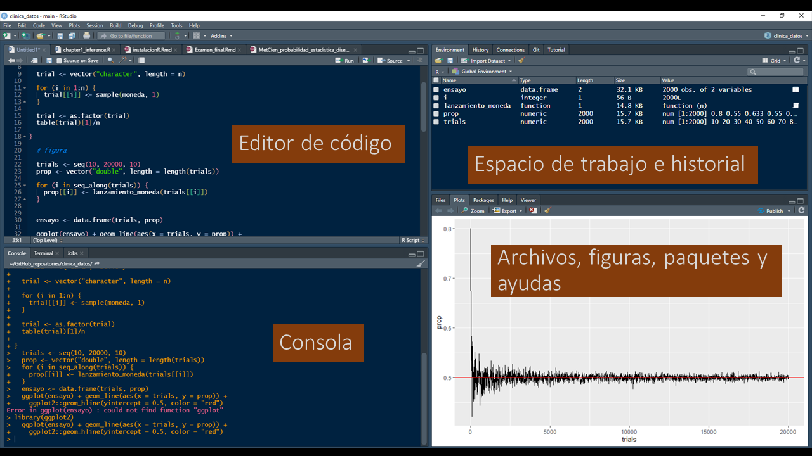
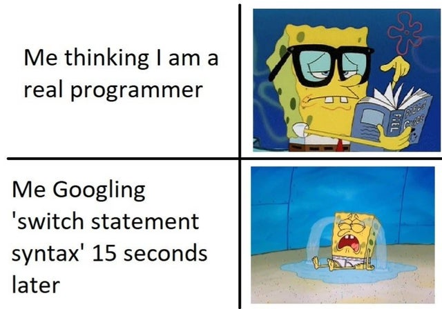

## RStudio. Ventanas y menú de opciones

<div align="center">

</div>

## R

!Una calculadora con esteroides!

```{r echo = TRUE}

(log(548) * log10(5)) - (exp(35 / 5) + pi^2 + sqrt(64))

- 8 * 8

2 + -2

```

## Algunos operadores básicos

**Matemáticos**

`+` suma, `-` resta, `*` multiplicación, `/` división, `^` exponencial.

**Lógicos**

`<` menor, `<=` menor o igual, `>` mayor, 
`>=` mayor o igual, `==` igual, `!=` differente,
`!X` no x, `X|Y` X o Y, `X&Y` X y Y.


Ya veremos cómo se emplean los operadores lógicos...


## Creando objetos 

R es un lenguaje de programación orientado a objetos. Es decir, creamos objetos al asignar datos o funciones a nombres particulares. 

<div class = "red2">
nombre `<-` datos o función
</div>

Símbolos de asignación: 
`<-` o `=`.

```{r echo = TRUE}

curso <- "clinica de datos"
curso # ejecutamos "curso" para verificar el elemento asignado 

# Cualquier escrito que antecede un `#` es entendido por R
# como un comentario que no afecta el código.


```

## `=` o `<-` funcionan igual como símbolos de asignación, peeero...

```{r echo = TRUE}
curso <- "clinica de datos"
```

```{r echo = TRUE}
curso = "clinica de datos"
```

Son lo mismo. Sin embargo, `=` también se emplea  para asignar valores a los argumentos en las funciones, mientras `<-` solo se usa como símbolo de asignación.

e.g.

```{r echo = TRUE, eval=FALSE}

mean(c(1, 2, 3, NA), na.rm = TRUE) 
```

Paciencia, pronto tendrá más sentido.

## entonces

<div align = "center">

</iuv>

## Vectores

Estructura básica y fundamental en la que se organizan los datos en R. 

```{r echo = TRUE, eval = TRUE}

x <- 8    # un vector puede contener desde 1 hasta n elementos. 
          
          # "length()" se usa para determinar la longitud o
length(x) # el número de elementos que tiene un objeto

y <- c(5, 1, 8, 22, 15021, 0.003) # La función concatenar "c()" 
                               # se usa para agrupar elementos. 
#Los elementos se separan con "," y los decimales SIEMPRE se denotan con "."
length(y) # En este caso cada número corresponde a un elemento 


```

## Clases de vectores

```{r echo = TRUE, eval = TRUE}

x <- c(5, 1, 8, 22, 15021, 0.003); class(x)

y <- c("jkgjh", "5gh54fb", "4h-k"); class(y)

z <- as.factor(c("grande", "mediano", "pequeño")); class(z)

l <- c(TRUE, TRUE, FALSE, TRUE, FALSE, FALSE); class(l)

```

## Indexando vectores

Cada elemento en un vector conserva una posición numérica específica a la que se puede hacer referencia usando corchetes

```{r echo = TRUE}
x
x[1]
x[c(1, 3:5)] 

```


## Agregar y eliminar elementos de un vector

Usando los indices de cada elemento en el vector
```{r echo = T, eval=T}

x <- c(5, 1, 8, 22, 15021, 0.003)

x[-5]  # elimina el elemento que se encuentra en la posición 5. 
       

x <- c(x, 55, 0, -4) # para agregar elementos se usa la función concatenar,
                     # se recicla el vector, se agregan los elementos y 
                     # se asigna de nuevo al nombre x.
x
```

## Ahora... 

Puede realizar la misma operación con operadores lógicos estableciendo alguna condición sobre el elemento a eliminar o filtrar.

```{r echo = T, eval=T}

x[x >= 1 & x < 100]

```

Internamente R evalúa si cada elemento del vector cumple la condición `x>=1 & x<100`, así:

```{r echo = TRUE}

x >= 1 & x < 100

```

## Matrices 

En esencia son vectores con dos dimensiones, columnas y filas. Solo pueden ser compuestas por un tipo de elemento (e.g., numérico, caracter, lógico). 

```{r echo = T}

x <- matrix(seq(from = 1, to = 50, by = 2), ncol = 5, nrow = 5)
x

# funciones ncol(), nrow() y dim()
```

## Indexación de matrices

Pueden indexarce los elementos por sus coordenadas o por su secuencia en la matriz. Por ejemplo en la matriz `x`:

```{r echo = TRUE}
x[6] # para indexar el número 11 podemos indicar su posición en el vector
        # o indicar su coordenada con respecto a 
x[1, 2] #la fila y columna (x[fila, columna])

x[, 1] # o seleccionar una columna completa. 

```

## Data frame

los data frames pueden ser vistos como una lista de vectores. El único requisito es que tengan la misma longitud.

```{r echo = TRUE}

df <- data.frame(edad = sample(x = 1:100, size = 5),
                 nombre = c("natalia", "julian", "jenny", "erika", "paulo"),
                 sexo = as.factor(c("f", "m", "f", "f", "m")))
df

# Explore las funciones names(), colnames(), 
# nrow(), ncol(), dim(), length() y object.size()
```

## Explorando DF
```{r echo = TRUE}
summary(df)

str(df)

```

## Extraer vectores o variables del DF

Hay cuatro formas con distintas implicaciones.

```{r echo = TRUE}
df[1]   # Extrae la columna conservando la clase
df[[1]] # Extrae la información en forma de vector

```

## ...

```{r echo = TRUE}
df[, 1] # Usando notación de matriz
df$edad # Especificando el nombre de la variable con el símbolo "$"

```
Su uso dependerá de la función y el propósito del código que estén desarrollando.

## Extrayendo subconjuntos en un DF

Se pueden emplear dos métodos
```{r echo = TRUE}
df[df$edad >= 20 &
     df$sexo == "f", ] # Usando notación de matrices y operadores lógicos

subset(x = df, df$edad >= 20 & 
         df$sexo == "f") # o empleando la función subset()
```
PD — !DF y matrices se indexan igual!

## Aplicando funciones a DF

```{r echo = TRUE}

sum(x = df$edad) # calcula la suma de todas las edades

mean(x = df[[1]], na.rm = TRUE) # calcula el promedio

```

Los argumentos en las funciones —como `x=` y `na.rm=` en la función `mean()`— definen su comportamiento. Pueden controlar objetos, operaciones lógicas y no tienen que ser explicitados en la función.

## Listas

Son estructuras de datos que pueden albergar vectores, matrices, DF e incluso otras listas.

```{r echo = TRUE}

lista <- list(c(rnorm(5)), df) # la función list() agrupa el 
                               # vector "c(rnorm(5))" y el data frame df

lista

```

##

La indexación de listas es solo un poco más compleja, Hadley Wickham lo resume de esta manera.

<div align="center">

</div>

## Primeros Gráficos. La función `plot()`
 
```{r echo = TRUE}
plot(iris$Species, iris$Sepal.Length, ylab = "Longitud sépalo", xlab = "Especie")

```

## 

```{r echo = TRUE}
plot(iris$Petal.Width, iris$Sepal.Length, 
     ylab = "Longitud sépalo", xlab = "Especie", col = "red", pch = 6)

```

## 

```{r echo = TRUE}
plot(iris$Petal.Width, iris$Sepal.Length, 
     col = ifelse(iris$Species == "setosa", "green",
                    ifelse(iris$Species == "virginica", 
                           "black", "blue")), pch = 19)
```

##

```{r echo = TRUE}
plot(density(iris$Sepal.Length), main = "Density plot")

```

## Instalar y cargar paquetes

Los paquetes son conjuntos de funciones que han sido disponibilizadas a través del CRAN para su uso público.

```{r echo = TRUE, eval = FALSE}

install.packages("paquete") # Instalar paquete
library(paquete) # Cargar paquete
require(paquete) # También se usa para cargar 
```

```{r echo = TRUE, eval = TRUE}

citation(package = "ggplot2") # para citar un paquete 

```

## Buscando ayuda!

```{r echo = TRUE, eval = FALSE}
?ggplot2        # ayuda específica
??ggplot2       # términos relacionados 
help("ggplot2") # similar a la primera

```
<div align = "center">

</div>

## mas ayudas...

Pueden consultar los argumentos de una función
```{r echo = FALSE}
library(ggplot2)
```

```{r echo = TRUE}
args(ggplot)

```

o solicitarle a R ejemplos de su uso!

```{r echo = TRUE}

example("mean")
```


